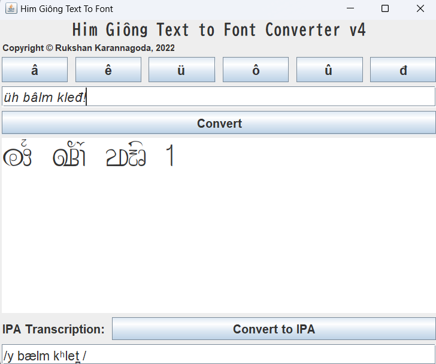

# Him Giông Transliterator

A Java GUI program to transliterate a romanized text into the non-Unicode font of Him Giông.

The application has 2 components:
1. Him Giông Transliterator
2. IPA converter

## 1. Him Giông Transliterator
Since Him Giông does not have Unicode support and is a very complex script and orthography, it is hard to input Him Giông without compromising usability.  
  
Thus, a rule-based transliterator was used to render the romanization on the correct font, and extra key buttons are added to input the latin characters that are not available in the standard ASCII keyboard.

## 2. IPA Converter
IPA Converter converts the romanization input of the user to its corresponding IPA pronunciation. 
It is also rule-based, and is still in beta mode.

## How to Download
1. Clone this repository to you machine.
2. In  the cloned HGMaven directory go to out/artiacts/HGMaven_jar
3. Open the HGMaven.jar file

## How to Build
1. Clone this repository to your machine.
2. Open the directory in Intellij IDEA
3. Go to build -> build artifacts 
4. The HGMaven.jar will be build in the out/artiacts/HGMaven_jar directory